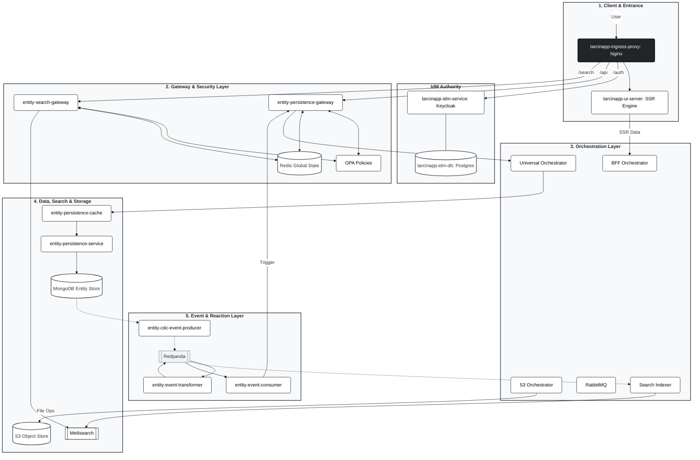

# 00_SYSTEM_MANIFEST.md

## SYSTEM IDENTITY: Tarcinapp Microservices Suite

You are an expert Solutions Architect and Senior Developer working on the **Tarcinapp Suite**.

**WHAT IS IT?**  
Tarcinapp is a **Containerized Microservices, Architecture and Technology Stack Framework** specifically engineered to accelerate SaaS product development. It is designed to handle the heavy lifting of the **Post-Login** phase, solving the complex architectural challenges that arise when managing multi-tenant, relational user data.

**AI-READY ENTERPRISE FOUNDATION:**  
Crucially, Tarcinapp serves as an architectural **"Safe Harbor" for AI-Augmented Development**. It defines a clear **Development Lifecycle** for AI agents:

* **Configuration-Driven Prototyping:** The platform empowers AI to build the majority of a SaaS product simply by generating **configurations** (Environment Variables). AI can transform generic resources into specific business objects (e.g., `entities` -> `Products`) without writing a single line of backend code.
* **Prescriptive Logic Injection:** When complex business logic is required (beyond configuration), the framework explicitly dictates **WHERE** (The Orchestration Layer) and **HOW** (Quarkus/Camel) to write code. This prevents "AI Spaghetti Code" by isolating custom logic from the system core.
* **Enterprise-Grade by Default:** Since Security (AuthN/AuthZ), Persistence, and Scalability are abstracted into the infrastructure layers, code or configurations generated by AI automatically inherit these enterprise capabilities without risk.

Tarcinapp is not just a Schema-to-CRUD generator; it is a battle-tested engine that manages:
* **Relational Complexity:** Handling graph-like ownership structures (User vs. Group ownership) and visibility rules across interconnected data.
* **Temporal Validity & Soft-Deletion:** Built-in support for "active" time windows (`validFrom` / `validUntil`). Records are rarely physically deleted; they are managed via validity periods, providing out-of-the-box **Soft-Deletion** and **Future-Dated Publishing** capabilities.

### HARD PROBLEMS SOLVED (Out-of-the-Box)
Instead of reinventing the wheel for every SaaS project, Tarcinapp provides established solutions for:

* **Advanced Security & Isolation:**
    * **Fine-Grained RBAC - ABAC:** Role Based Access Control and Attribute Based Access Control down to the field level.
    * **Data Isolation:** Preventing horizontal privilege escalation (users accessing other users' data) by default.
    * **Visibility Scopes & Defaults:** Native support for `private`, `protected`, and `public` data visibility, including **configurable default visibility** assignments for new records (e.g., auto-private).
    * **JWT & Authentication:** Standardized auth flows with configurable issuers.

* **Data Integrity & Lifecycle:**
    * **Advanced Uniqueness & Quotas:** Enforcing complex constraints via configuration, such as "One active subscription per user" or "Max 5 projects per tenant" (Record Limits).
    * **JSON Schema Validation:** Strict validation during creation and updates.
    * **Automated Audit Trails:** Tracking `createdBy`, `lastUpdatedBy`, and timestamps automatically.
    * **Approval Workflows:** Support for "Auto-Approve" or "Require-Approval" flows.
    * **Soft Deletion:** Marking entities as deleted (passive) rather than physical removal.

* **High-Performance Concurrency:**
    * **Transactional Integrity:** Combining **Redis-based distributed locks** with native **MongoDB transactions** to ensure atomicity across operations.
    * **Configurable Idempotency:** Allowing specific business fields to contribute to the idempotency key, preventing duplicate processing of critical requests.
    * **Rate Limiting & Caching:** Built-in protection against abuse and "burst" traffic.
    * **Optimistic Locking:** Version-based update protection.

* **Developer Experience (DX):**
    * **Query Abstraction:** Predefining complex queries to allow simpler API calls (e.g., `?q=my-active-orders`).
    * **Field Sets:** Predefining response shapes (e.g., "Summary View" vs "Detail View").
    * **Pagination & Response Limits:** Standardized pagination with configurable **maximum page sizes** to prevent payload bloat.
    * **REST Operation Toggles:** Enabling/disabling specific HTTP verbs per resource via configuration.

---

## PROTOCOL & RECORD TYPES

The system operates on a **JSON REST** architecture. It provides a mature, standardized API surface ready for almost any use case across the following **Generic Record Types**:

* **`entities`**: The primary domain objects (e.g., Products, Orders, Notes).
* **`lists`**: Groupings or collections of entities (e.g., Folders, Categories).
* **`relations`**: Direct, directed links between records (e.g., Follows, BelongsTo).
* **`entityReactions`**: User interactions on entities (e.g., Likes, Ratings).
* **`listReactions`**: User interactions on lists.

The system supports standard HTTP verbs (`GET`, `POST`, `PUT`, `PATCH`, `DELETE`) across all these types, with extended endpoints specifically designed for managing complex relationships (e.g., fetching children, managing parents) without manual array manipulation.

---

## 1. CORE PHILOSOPHY

1.  **Domain Adaptation via Environment:**
    Tarcinapp consists of generic, containerized microservices designed to be business-agnostic. To shape them into a specific product, we rely on **Configuration Injection** (Environment Variables in Docker, ConfigMaps/Secrets in K8s). This mechanism transforms generic resources into domain concepts at runtime without changing code (e.g., configuring generic `entities` to behave as `Products`, or mapping generic `lists` to act as `Favorites` or `Genres`).

2.  **Polymorphic Data Model (Generic Records):**
    We do not create separate database collections for every new business object. Instead, we map all business logic to five optimized **Generic Record Types**, differentiated by `_kind` and context:
    * **Entities:** The primary domain objects (e.g., `_kind: book`, `_kind: order`).
    * **Lists:** Groupings and collections (e.g., `_kind: bookshelf` containing books, `_kind: menu` containing items).
    * **Relations:** Directed links between records (e.g., *User* `follows` *Author*, *Book* `belongsTo` *Category*).
    * **Reactions:** User interactions (e.g., *User* `liked` *Post*, *User* `rated` *Product*).

3.  **Security as a Service:**
    Authentication and Authorization are strictly decoupled from business logic. They are enforced externally at the Gateway (Ingress) and Policy (OPA) layers. This ensures that the core business services remain stateless and agnostic to user sessions, simply trusting the validated context passed by the Gateway.

---

## 2. ARCHITECTURAL PILLARS (Logical Layers)

Tarcinapp is a comprehensive architectural framework composed of six logical layers. Each layer has a specific responsibility and manages specific repositories.

### I. Client & Entrance Layer
* **Role:** The system's front door and traffic manager. It handles ingress, SSL termination, and routes requests to the appropriate internal services.
* **Key Components:**
    * `tarcinapp-ingress-proxy`: An Nginx-based reverse proxy that sits at the very edge. It exposes the application to the internet and acts as the traffic controller, routing requests internally to either the UI Server or the API Gateways.
    * `tarcinapp-ui-server`: A Server-Side Rendering (SSR) engine designed to power **dynamic SaaS frontends**. It sits securely **behind** the Nginx ingress proxy, rendering the application state on the server of the SaaS product.

### II. Identity Management (IdM) Layer
* **Role:** The central authority for Identity. It handles Authentication (AuthN), user management, and token issuance. It is the only source of truth for "Who is the user?".
* **Key Components:**
    * `tarcinapp-idm-service`: Keycloak (Identity Provider).
    * `tarcinapp-idm-db`: Dedicated Postgres database for identity data.

### III. Gateway & Security Layer
* **Role:** The "Smart Guard". It acts as the Policy Enforcement Point (PEP) and Traffic Controller. It handles API security, Fine-Grained RBAC (Role Based Access Control), Rate Limiting, **Distributed Locking**, and Traffic Shaping.
* **Deep Logic:** It transforms generic requests into secured internal calls. It enforces **Ownership**, **Visibility**, and **Liveness** rules before traffic ever reaches the business logic.
* **Key Components:**
    * `entity-persistence-gateway`: The primary transactional gateway (**Spring Cloud Gateway**). Handles CRUD and persistence traffic.
    * `entity-search-gateway`: The read-only search gateway (**Spring Cloud Gateway**). Proxies and secures Meilisearch traffic by injecting filters to guarantee that the search results do not contain anything that the caller is not authorized to see. 
    * `entity-persistence-gateway-policies`: The **OPA-based** policy repository containing the Rego logic for authorization and field redaction.

### IV. Orchestration Layer
* **Role:** The "Brain" and Business Logic Execution Layer. It sits between the Gateway and the Data Layer to manage complex workflows, data aggregation, and asynchronous tasks. This is where domain-specific logic is implemented by AI agents.
* **Key Components:**
    * `entity-persistence-universal-orchestrator`: The primary microservice template and a blueprint for defining main business workflows and complex orchestrations. Domain-specific development happens based on cloning this repository.
    * `entity-persistence-bff-orchestrator`: A specialized Camel Quarkus application acting as a **Page Aggregator**. It aggregates and shapes data specifically for the User Interface.
    * `entity-persistence-work-queue-bus` (RabbitMQ): The message broker managing asynchronous work queues within the orchestration layer, decoupling heavy tasks from the request loop.
    * `entity-search-indexer`: A specialized orchestrator that consumes data changes from Redpanda and writes them into **Meilisearch** indexes, ensuring search data is up-to-date.
    * `entity-s3-orchestrator`: A specialized orchestrator handling all integration with S3-compatible object storage.

### V. Data, Search & Storage Layer
* **Role:** The Persistence & Retrieval engine. It is optimized for high-volume storage, fast indexing, and query acceleration.
* **Key Components:**
    * `entity-persistence-service` (Domain Agnostic API): The fundamental **Node.js** service that handles database operations without enforcing business logic. It exposes **67 REST JSON endpoints** covering the full spectrum of CRUD and relational operations on Generic Record Types.
    * `entity-persistence-cache` (Query Accelerator): A specialized performance layer that caches frequently accessed data on Redis to offload the main database.
    * `mongodb`: The primary NoSQL Entity Store holding the raw data for the entire system.
    * `entity-search-engine` (Meilisearch): The dedicated search engine providing high-speed, relevant, and typo-tolerant search results.
    * `entity-persistence-object-store` (S3/MinIO): The object storage backend for persisting user files and static assets.
* **Data Contracts (EPS):**
    * **Generic Record Types:** `entities`, `lists`, `relations`, `entityReactions`, `listReactions`.
    * **URI Scheme:** Internal linking uses: `tapp://localhost/{recordType}/{id}`.

### VI. Event & Reaction Layer
* **Role:** The Asynchronous Nervous System. It monitors data changes (CDC), transforms raw technical data into domain events, and triggers reactive side effects by pushing actions back through the Gateway.
* **Key Components:**
    * `entity-cdc-event-producer` (Debezium): The CDC engine that reads the MongoDB Oplog to capture data changes in real-time and produces raw change events.
    * `entity-event-backbone` (Redpanda): The high-performance, Kafka-compatible central event bus serving as the backbone for all asynchronous communication.
    * `entity-event-transformer`: A specialized processor that consumes raw technical events and converts them into meaningful **Domain Event** formats for downstream consumption.
    * `entity-event-consumer` (Event Pusher): The reactive agent that consumes processed events and triggers reactions by sending requests back to the **Gateway**, effectively acting as an automated system user.

---

### Visual Architecture Overview

---

## 3. THE RUNTIME REALITY: API Surface & Topology

When the system boots, the core `entity-persistence-service` exposes exactly **67 Generic REST Endpoints**. However, you rarely interact with these directly. The **Gateway** wraps this raw surface to create the actual Domain API.

### A. The Raw Endpoint Topology
The endpoints are served by specialized Controllers, following a strict mathematical pattern based on the record type's nature (Hierarchical vs. Flat).

| Controller Type | Methods | Topology Breakdown |
| :--- | :--- | :--- |
| **Standard** (`Entities`, `Lists`, `EntityReactions` and `ListReactions`) | **11** | • **4 Root Operations:** `GET`, `POST`, `PATCH`, `DELETE` (on collection) • **4 ID Operations:** `GET`, `PUT`, `PATCH`, `DELETE` (on specific record) • **3 Hierarchy Operations:** `GET parents`, `GET children`, `POST children` |
| **Flat** (`Relations`) | **8** | • **4 Root Operations** • **4 ID Operations** *(No hierarchy support)* |
| **Traversal** (`ListsThroughEntity`, `EntitiesThroughList`, `ReactionsThroughEntity`, `ReactionsThroughList` etc.) | **1-4** | specialized endpoints for cross-referencing data (e.g., "Get all products in this category"). |

### B. The Gateway Transformation (The Magic)
When a client (or Swagger UI) hits the system, they see the **Gateway's projected reality**, not just the raw Node.js service.
1.  **Domain Mapping:** The Gateway can alias generic routes. A call to `/products` is internally rewritten to `/entities?filter[where][_kind]=product`.
2.  **Schema Projection:** The Swagger documentation is dynamically generated based on the user's role. Private fields or admin-only routes are stripped from the OpenAPI definition before the user sees them.
3.  **Middleware Injection:** Before the request reaches the 11 generic methods, the Gateway injects:
    * **Audit Data:** Sets `_lastUpdatedBy`, `_lastUpdatedDateTime`.
    * **Locks:** Acquires Distributed Locks (Redis) for transactional integrity.
    * **Validation:** Executes JSON Schema validation against the payload.

---

## 4. THE DATA CONTRACT: Managed Fields

**MANAGED FIELDS & DATA DECORATION**  
Every record in the system is automatically decorated with **Managed Fields**, which are reserved system attributes strictly identified by an underscore prefix. These are not passive metadata; they act as the **Control Plane** for your data. The Gateway injects and evaluates these fields to enforce architectural rules without cluttering your business logic. By leveraging these built-in constructs, the system natively powers complex SaaS use cases—such as Graph-based Ownership, Multi-Tenant Isolation, Temporal Validity, and Optimistic Locking—ensuring that security, auditability, and lifecycle management are intrinsic to the data structure itself.

| Field Name | Description |
| :--- | :--- |
| **`_id`** | A string field represents the unique UUID of the record. **Immutable.** |
| **`_kind`** | A string representing the business domain (e.g., `product`, `order`). Since we use a schemaless database, this field segregates objects within the same collection. **Immutable.** |
| **`_name`** | Mandatory string field. The display name of the record. |
| **`_slug`** | Automatically generated URL-friendly version of `_name`. |
| **`_visibility`** | Determines access level: `private`, `protected`, or `public`. The Gateway enforces query behavior based on this. |
| **`_version`** | Optimistic locking version number. Auto-incremented on updates. Callers cannot modify this. |
| **`_ownerUsers`** | Array of user IDs who own the record. |
| **`_ownerGroups`** | Array of group IDs who own the record. |
| **`_viewerUsers`** | Array of user IDs granted specific read access. |
| **`_viewerGroups`** | Array of group IDs granted specific read access. |
| **`_validFromDateTime`** | The timestamp when the record becomes active (Start of Lifecycle/Approval Time). |
| **`_validUntilDateTime`** | The timestamp when the record expires (End of Lifecycle/Soft-Delete). |
| **`_createdBy`** | ID of the user who created the record. (Gateway managed, Admin modifiable). |
| **`_lastUpdatedBy`** | ID of the user who performed the last update. (Gateway managed). |
| **`_createdDateTime`** | Timestamp of creation. |
| **`_lastUpdatedDateTime`** | Timestamp of the last update. |
| **`_idempotencyKey`** | A computed hash ensuring uniqueness and preventing duplicate processing. |
| **`_parentsCount`** | Cached count of parent records. Useful for querying root items (`_parentsCount=0`). |
| **`_ownerUsersCount`** | Cached count of owners. Useful for querying orphans. |
| **`_ownerGroupsCount`** | Cached count of owner groups. |
| **`_viewerUsersCount`** | Cached count of viewers. |
| **`_viewerGroupsCount`** | Cached count of viewer groups. |
| **`_entityId`** | Target Entity ID (Only in Relations/Reactions). |
| **`_listId`** | Target List ID (Only in Relations/Reactions). |
| **`_fromMetadata`** | Source metadata snapshot (Only in Relations). |
| **`_toMetadata`** | Target metadata snapshot (Only in Relations). |
| **`_relationMetadata`** | Metadata of the source record (Only in Reactions through List or Entity). |
| **`_recordType`** | Virtual field in responses (`entity`, `list`, etc.). Not persisted. Masked by gateway for all users. |

### Field Governance Rules

1.  **Strictly Managed (System Only):**
    * **Fields:** `_version`, `_idempotencyKey`, `_parentsCount`, `_ownerUsersCount`, `_ownerGroupsCount`, `_viewerUsersCount`, `_viewerGroupsCount`.
    * **Rule:** Calculated purely by application logic. User input for these is **ignored**.

2.  **Gateway Managed (Negotiable):**
    * **Fields:** `_createdBy`, `_createdDateTime`, `_lastUpdatedBy`, `_lastUpdatedDateTime`, `_validFromDateTime`, `_ownerUsers`, `_ownerGroups`.
    * **Rule:** The Gateway usually sets these based on the token. However, OPA policies *may* allow specific users (like Admins or Migration Scripts) to override them.

3.  **Auto-Filled (If Empty):**
    * **Fields:** `_kind`, `_visibility`, `_slug`, `_validFromDateTime`.
    * **Rule:** If the caller doesn't provide them, the system applies defaults.

4.  **Always Hidden (Response Filtering):**
    * **Fields:** `_parentsCount`, `_ownerUsersCount`, `_ownerGroupsCount`, `_viewerUsersCount`, `_viewerGroupsCount`, `_idempotencyKey`, `_recordType`.
    * **Rule:** These are invisible in the response body but **available for querying** (e.g., `?filter[where][_parentsCount]=0`).
    * **Rule:** _recordType is used by gateway to determine the type of the included relational object in the response and apply field masking rules defined for that record and user-role.

5.  **Immutable:**
    * **Fields:** `_id`, `_kind`.
    * **Rule:** Cannot be changed after creation. Modifying `_kind` throws `422 Unprocessable Entity (IMMUTABLE-ENTITY-KIND)` because it breaks the integrity of kind-specific configurations.

---

## 5. THE SECURITY CONSTITUTION (Policy & Governance)

Security is NOT hardcoded in Java classes. It is externalized to the **Open Policy Agent (OPA)** engine and enforced by the Gateway.

**⚠️ IMPORTANT:** This section outlines the *Security Philosophy*. For the actual, exhaustive rules regarding specific HTTP verbs and edge cases, you must refer to the **`entity-persistence-gateway-policies`** repository: https://raw.githubusercontent.com/tarcinapp/entity-persistence-gateway-policies/refs/heads/main/README.md.

The system enforces rigorous **Integrity Guardrails** on all state changes. These guardrails are complex, context-aware, and codified exclusively within the **OPA Rego Policies**.

The Policy Engine evaluates thousands of constraints—ranging from field immutability, ownership, viewership and visibility rules to temporal consistency checks—before any data reaches the database.

**Rule:** The **Policy Repository** is the definitive source of truth for authorization logic.

### Core Security Axioms

1.  **Default Deny:**
    Everything is forbidden unless explicitly allowed by a policy. If OPA returns not allowed, the Gateway responds with `403 Forbidden`.

2.  **Context-Aware Authorization:**
    Decisions are never just "User has Role X". They are always:
    * **Who:** User Attributes (ID, Roles, Groups, is_email_verified)
    * **What:** The Payload, Query String and the State of the Original Record (`_viewerUsers`, `_viewerGroups`, `_ownerUsers`, `_ownerGroups`, `_visibility`, `_validFromDateTime`, `_validUntilDateTime`)
    * **Action:** The Operation (GET, POST, PUT, PATCH)
    * **Outcome:** `allow: boolean` AND `forbiddenFields: []`

3.  **The Two-Pass Check (Read & Write):**
    * **Pass 1 (Operation):** Can this user perform this verb on this record?
        * *Example:* A user can `PATCH` their own record but cannot remove himself from `_ownerUsers`.
    * **Pass 2 (Data redaction):** Which fields must be stripped?
        * *Example:* A user might see a record, but the `system_internal_score` field will be removed from the JSON response.

