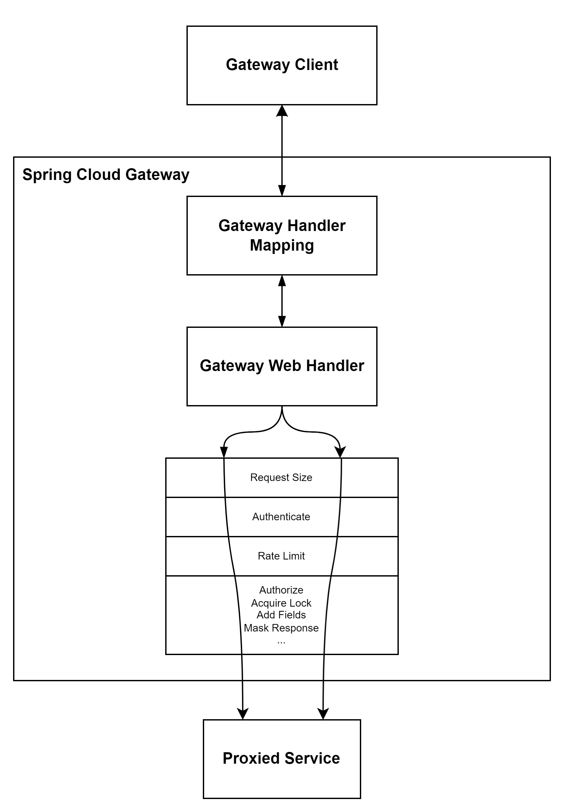
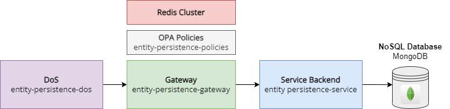

- [Overview](#overview)
  - [What is Tarcinapp Suite?](#what-is-tarcinapp-suite)
- [Entity Persistence Gateway in Detail](#entity-persistence-gateway-in-detail)
  - [Managed Fields](#managed-fields)
    - [User Roles and Managed Fields](#user-roles-and-managed-fields)
  - [Field Masking](#field-masking)
    - [Field Masking for Update \& Replace Operations](#field-masking-for-update--replace-operations)
- [Configuration](#configuration)
  - [Application Name \& Shortcode](#application-name--shortcode)
  - [Backend and OPA Host Configuration](#backend-and-opa-host-configuration)
  - [Authentication](#authentication)
    - [Role Extraction](#role-extraction)
    - [Email Verification Status](#email-verification-status)
  - [Authorization](#authorization)
  - [Saved Field Sets](#saved-field-sets)
    - [Default Field Set](#default-field-set)
  - [Saved Queries](#saved-queries)
  - [Loopback Query Abstraction](#loopback-query-abstraction)
  - [Rate Limiting](#rate-limiting)
  - [Request Size Limiting](#request-size-limiting)
  - [Routing by Kind Configuration](#routing-by-kind-configuration)
- [Local Development](#local-development)

# Overview
The Entity Persistence Gateway, powered by [Spring Cloud Gateway](https://spring.io/projects/spring-cloud-gateway) framework, is a central component within the Tarcinapp Suite. This gateway provides comprehensive functionality, including
* Authentication
* Authorization
* Routing
* Rate Limiting
* Distributed Lock
* Field masking
* Predefined queries
* Predefined sets of fields to streamline querying processes

Here is the visualized representation of the request-response flow for the `createEntity` operation in the entity-persistence-gateway application.
<p align="center">
  
</p>

As the front door to the Entity Persistence Service and Entity Persistence Policies, the Entity Persistence Gateway efficiently handles incoming requests, enforces security policies, and orchestrates responses. With its diverse set of features, it simplifies the management of fine-grained access control, making it an indispensable part of your application ecosystem.

## What is Tarcinapp Suite?

The Tarcinapp suite is a comprehensive and flexible application framework, harmoniously blending a suite of interconnected components designed to deliver a seamless and secure microservices architecture. It also provides the flexibility for users to leverage it as an upstream project for their own REST API-based backend implementations, allowing for easy adaptation to their specific requirements and use cases.

<p align="center">
  
</p>

At its core is the **Entity Persistence Service**, an easily adaptable REST-based backend application built on the [Loopback 4](https://loopback.io) framework. This service utilizes on a schemaless MongoDB database to provide a scalable and highly adaptable data persistence layer. Offering a generic data model with predefined fields such as `id`, `name`,  `kind`, `lastUpdateDateTime`, `creationDateTime`, `ownerUsers` and [more](#programming-conventions), it effortlessly adapts to diverse use cases.  

The integration with the **Entity Persistence Gateway** empowers users to implement enhanced validation, authentication, authorization, and rate-limiting functionalities. Leveraging the power of **Redis**, the application seamlessly manages distributed locks and rate limiting. Furthermore, the ecosystem includes the [Open Policy Agent (OPA](https://www.openpolicyagent.org)) to enforce policies, safeguarding your application against unauthorized access and ensuring compliance with your security and operational requirements.  
  
Here is an example request and response to the one of the most basic endpoint: `/generic-entities`:
<p align="left">
  
</p>  

**Note:** The client's authorization to create an entity, the fields that user can specify, and the fields returned in the response body may vary based on the user's role. The values of managed fields such as `visibility`, `idempotencyKey`, `validFromDateTime`, and `validUntilDateTime` can also be adjusted according to the user's role and the system's configuration.  See [Field Masking](#field-masking).
  
**Note**: Endpoints can be configured with arbitrary values within the gateway component. For example, `/books` can be used for records with `kind: book`, and the field `kind` can be completely omitted from the API interaction. See [Routing by Kind Configuration](#routing-by-kind-configuration).

# Entity Persistence Gateway in Detail
Serving as a reverse proxy to each endpoint defined by the Entity Persistence Service, it channels incoming requests to their respective destinations. This enables the Entity Persistence Gateway to efficiently manage API traffic, enforce security policies, and direct responses back to the requesting clients. It ensures that clients interact with the Entity Persistence Service in a secure and controlled manner, serving as a crucial security and routing layer for your application.  

Here's a more structured list of the capabilities provided by the Entity Persistence Gateway:  
1. **Request Size Limiting**: The gateway enforces a default 1KB limit on incoming HTTP request sizes to prevent oversized requests from reaching the Entity Persistence Service.

2. **Request Rate Limiting**: Rate limiting mechanisms are applied uniformly to all endpoints to control the rate of incoming requests, ensuring fair usage and system stability.

3. **JWT Token Validation**: The gateway validates incoming JWT-based authorization tokens to ensure that requests to the Entity Persistence Service are accompanied by valid and secure authorization.

4. **Authorization Policy Execution**: Leveraging the Open Policy Agent (OPA), the gateway executes authorization policies that determine who can create, update, or query specific records, providing fine-grained access control.

5. **Role-Based Field Management**: The gateway dynamically manages certain fields (e.g., `ownerUsers`, `ownerGroups`, `creationDateTime`, `createdBy`, `lastUpdatedDateTime`, `lastUpdatedBy`) according to the caller's role, ensuring controlled access and data integrity.

6. **Field Masking**: The gateway masks certain fields in responses based on the results of policy execution, enhancing data security by restricting sensitive information from being exposed. To learn how to configure which role can see what field see [entity-persistence-gateway-policies](https://github.com/tarcinapp/entity-persistence-gateway-policies).

7. **Query Scope Reduction**: The gateway reduces the scope of queries based on the caller's role, ensuring that users can only access data that aligns with their authorized roles and permissions.

8. **Distributed Lock Management**: For CRUD operations, the gateway acquires distributed locks to prevent data conflicts and ensure data consistency in a distributed system.

9.  **Query Language Abstraction**: The gateway hides the underlying Loopback data querying notation from clients, simplifying the API interaction and providing a user-friendly query experience. For example, clients can use `?limit=5&skip=10` instead of `?filter[limit]=5&filter[skip]=10`.

10. **Field Sets for Easier Querying**: It offers the ability to define sets of fields, enhancing the querying process by allowing clients to request specific sets of fields for response data. Field sets are defined at the gateway configuration. This way, clients can make a query like `?fieldset=bookinfo` which only returns `id`, `name` and `author` fields only of the book records.

11. **Predefined Queries**: Clients can utilize predefined queries (e.g., `?q=my-query`) to streamline their data retrieval process by specifying common query conditions. When setting up predefined queries, utilize context variables such as user id and other query parameters. You can leverage advanced Java operations using SPEL to manipulate these variables while constructing the query for the backend.

12. **Route Configuration**: The gateway allows route configuration for the `/generic-entity` endpoint based on the 'kind' of entity. For example, it can route all requests for `kind: book` to the `/generic-entity`, narrowing the scope specifically to book records for all CRUD operations. Multiple routes can be defined for various kinds, providing semantic endpoints in routing requests to the Entity Persistence Service.

These capabilities collectively empower the Entity Persistence Gateway to deliver comprehensive security, access control, data management, and routing features to your application.

## Managed Fields
Gateway application is responsible for managing and populating certain fields during the creation and update of entities. These fields are considered as managed fields and are added to the request payload before it is sent to the backend service. Managed fields include:
* `creationDateTime`
* `lastUpdatedDateTime`
* `ownerUsers`
* `createdBy`
* `lastUpdatedBy`  

These fields carry important metadata about the entity, such as creation and update timestamps, ownership information, and the creator's identity. entity-persistence-gateway ensures that the values for these fields are appropriately set based on the authorization context. For instance, creation and last update timestamps are set to the current time, while ownership and creator information are derived from the authenticated subject.

### User Roles and Managed Fields
In cases where administrators are authorized to directly modify managed fields, the entity-persistence-gateway defers the decision to [entity-persistence-gateway-policies](https://github.com/tarcinapp/entity-persistence-gateway-policies). These policies determine if the requested changes comply with defined policies. For more restricted roles like editors, members, and visitors, the gateway automatically populates managed fields based on established policies, ensuring data integrity and adherence to security measures. If client attempts to set one of the managed fields, while not authorized to do, gateway returns `401 Unauthorized`.
  
To learn more about which fields are forbidden for which roles, see the [forbidden fields file](https://github.com/tarcinapp/entity-persistence-gateway-policies/blob/main/policies/fields/generic-entities/forbidden_fields.rego) within [entity-persistence-gateway-policies](https://github.com/tarcinapp/entity-persistence-gateway-policies).

## Field Masking
In the entity-persistence-gateway, we apply field masking to enhance data security by restricting the exposure of sensitive information. This is achieved based on the results of policy execution, where the policy determines the list of [forbidden fields](https://github.com/tarcinapp/entity-persistence-gateway-policies/blob/main/policies/fields/generic-entities/forbidden_fields.rego). The gateway then applies this list to mask certain fields in the response.  

This field masking is implemented across multiple routes: `createEntity`, `findEntityById` and `findAll` operations. It's important to note that policy application plays a decisive role in determining who can see what. Additionally, unlike the loopback approach, which allows clients to choose fields in the response, the entity-persistence-gateway simplifies the process by unconditionally dropping unwanted fields from the response, ensuring a consistent and secure field masking mechanism at the response flow.
 
### Field Masking for Update & Replace Operations
In the context of the `replaceEntityById` operation, clients are required to send all fields of the entity specified by its ID. This raises a crucial question: how should clients provide new values for fields they are not allowed to see? If a client attempts to set a value for a forbidden field, the gateway responds with a `401 Unauthorized`, preventing the update of restricted information. 
But if the client omits these fields, the gateway ensures the new entity retains its original values in the original record, for those specific fields.  
This approach maintains a balance between allowing clients to update visible fields and enforcing security restrictions on sensitive data, ensuring a secure and controlled update process for entities.

# Configuration
The overall configuration of the Entity Persistence Gateway is primarily managed through a Spring YAML file. You can see the whole configuration from this file: [application.yaml](src/main/resources/application.yml).

You can map environment variables to various configuration properties in the Spring application.yaml file for containerized environments.  
For example to configure  `app.auth.rs256PublicKey` parameter in the YAML file you can use the environment variable named `APP_AUTH_RS256PUBLIC_KEY`. See [Externalized Configuration](https://docs.spring.io/spring-boot/docs/1.5.6.RELEASE/reference/html/boot-features-external-config.html).

## Application Name & Shortcode
**Application Name:**  
This configuration is passed to `spring.application.name`. This ensures consistency across the application, allowing Spring components to identify the application by its configured name.

* **Key**: `app.name`
* **Description**: Set the name of your application. This name is used internally and can represent the nature of your application, such as "books," "recipes," or "movies."

```yaml
app:
  name: entity-persistence-gateway
```  
  
**Shortcode:**
This configuration is used in constructing role names and other application-specific identifiers. Ensure that the shortcode is a concise representation of your application.  

* **Key**: `app.shortcode`
* **Description**: Shortcode serves as a prefix for generated request IDs and role names. For instance, if shortcode is set to "tarcinapp" role names will be constructed as "tarcinapp.member".
```yaml
app:
  shortcode: "tarcinapp"
```

## Backend and OPA Host Configuration
Configure the connection details for the backend service that serves the entity-persistence-service and entity-persistence-gateway-policies.

**Entity Persistence Service Configuration:**  
Configure the connection details for the backend service that serves the entity-persistence-service. Use the `app.backend` section in your YAML configuration to set the protocol, host, and port for communication with the entity-persistence-service.
```yaml
app:
  backend:
    protocol: http
    host: entity-persistence-service
    port: 80
    baseURI: '/'
```

**Open Policy Agent (OPA) Host Configuration:**  
Configure the connection details for the Open Policy Agent (OPA) host, responsible for managing external policies related to the application. Use the app.opa section in your YAML configuration to set the protocol, host, and port for communication with the OPA host.

```yaml
app:
  opa:
    protocol: https
    host: entity-persistence-gateway-policies
    port: 443
```

## Authentication
Entity Persistence Gateway utilizes JWT-based token authentication to secure its endpoints. JWT token validation is a crucial step in ensuring that requests to the gateway are legitimate. This validation process is based on the presence of an RS256 encrypted public key that should be provided.

```yaml
app:
  auth: 
    rs256PublicKey: your-public-key-here
```

### Role Extraction
Roles play a critical role in controlling and authorizing access to various parts of the Entity Persistence Gateway. These roles are extracted from the JWT token provided in the request. To properly set roles for your users, ensure that the JWT token includes a string array of roles, identified by the roles key. Assuming your `app.shortcode` is configured as tarcinapp:  

```json
{
  "roles": ["tarcinapp.admin", "tarcinapp.editor", "tarcinapp.member"],
  // Other JWT claims...
}

```
In the example above, the JWT token includes an array of roles that are essential for determining the user's access level within the system.

### Email Verification Status
Email verification status is another important attribute that can influence a user's access to certain resources. The JWT token should include the email verification status, marked by the `email_verified` key.

```json
{
  "email_verified": true,
  // Other JWT claims...
}
```

## Authorization
Tarcinapp Suite utilizes a role-based access control system, provided by the entity-persistence-policies and entity-persistence-gateway components, to determine whether a caller is authorized to execute particular operations or access specific fields.

Roles within Tarcinapp Suite are derived from JWT claims, specifically from the `roles` field in the JWT body. Each user is assigned roles via this string array field.

Effective role names can be constructed using the application short code, `tarcinapp` for instance, as a prefix to enable a single user to have different roles for various Tarcinapp instances. This prefix is taken from the `app.shortcode` configuration. For instance if `app.shortcode` value is configured as `tarcinapp`, then these are the valid roles for that specific application instance: `tarcinapp.member`, `tarcinapp.editor`, etc.. Similarly, you can set `app.shortcode` to `books` and assign a user the `books.member` role to grant them the corresponding permissions for that specific Tarcinapp instance.  

To determine if a user is allowed to perform an operation, a policy data containing the application shortcode, JWT token, request body, requested endpoint, query parameters and HTTP headers is prepared and sent to the entity-persistence-policies component through an HTTP call. If request is allowed, gateway permits the flow to proceed. Otherwise, gateway returns a HTTP 401 error. Similarly, same policy data is used to determine which fields are forbidden for what operation.

To learn what roles are privileged to make which operations see [entity-persistence-policies](https://github.com/tarcinapp/entity-persistence-gateway-policies#policies) documentation for each route.

## Saved Field Sets
Field sets can be defined in configuration file to make querying a complex list of fields easier. Instead of naming every field in the query parameter clients can give the name of the field set.  
These are the preconfigured field sets:  
```yaml
app: 
 fieldsets:
    managed:
      show: id, kind, name, slug, visibility, version, ownerUsers, ownerGroups, ownerUsersCount, ownerGroupsCount, creationDateTime, lastUpdatedDateTime, lastUpdatedBy, createdBy, validFromDateTime, validUntilDateTime, idempotencyKey
    unmanaged:
      hide: slug, visibility, version, ownerUsers, ownerGroups, ownerUsersCount, ownerGroupsCount, creationDateTime, lastUpdatedDateTime, lastUpdatedBy, createdBy, validFromDateTime, validUntilDateTime, idempotencyKey
```
  
`app.fieldsets.managed`: Selects only the managed fields from the backend.  
`app.fieldsets.unmanaged`: Selects only the unmanaged fields from the backend. Only id, name and kind is kept in the list of requested fields along with other unmanaged fields.

Field sets can be used in query parameters such as:  
`generic-entities?fieldset=unmanaged`  

**Example field set configuration for books application**:  
```bash
APP_FIELDSETS_BOOKINFO=id, name, slug, author
```

**Note:** Role-based field masking remains in effect. Even if clients make specific requests or use field sets, they will be unable to view certain fields unless they have the necessary authorization.

### Default Field Set
You can define a default field set configuration which applies to all findAll, findById and create operations. Default field set can be configured as follows:
`app.defaultFieldset:unmanaged`

## Saved Queries
A query parameter string can be configured to shorten the long list of commonly used queries. Context variables such as `userId`, `now` can be used while building queries. You can use `query` context variable to access other query parameters to build new query to the backend.

Here you can find examples from predefined queries:

```yaml
app:  
  queries:  
    my: "'sets[owners]=['+#userId+'][]'"  
    actives: "'sets[actives]'"
```
**Example usage:**  
`/generic-entities?query=my` mapped to `generic-entities?sets[actives]`

**Introducing new predefined query configuration:**  
```bash
APP_QUERIES_BY_BOOK_NAME="'filter[where][slug]=' + #query['book-name']"
```
Usage: `/books?q=by-book-name&book-name=overcoat`

Note that predefined query configuration within entity-persistence-gateway levareges [Spring Expression Language (SPEL)](https://docs.spring.io/spring-framework/docs/3.0.x/reference/expressions.html) to let advanced configurations. 
## Loopback Query Abstraction
Loopback 4 is using a certain notation to enable backend querying as described here: [Querying Data](https://loopback.io/doc/en/lb4/Querying-data.html). While Loopback's approach is very useful, it may be a vulnerability to let your clients know what backend technology you are using.  
`app.allowLoopbackQueryNotation` configuration can be useful for purpose.

**Searching Entities:**  
**Original**: `?s=foo`  
**Mapped**: `?filter[where][name][regexp]=.*foo.*`  

**Ordering Entities:**  
**Original**: `?order=name`  
**Mapped**: `?filter[order]=name`  

**Skipping Entities:**  
**Original**: `?skip=10`  
**Mapped**: `?filter[skip]=10`  

**Limiting Entities:**  
**Original**: `?limit=20`  
**Mapped**: `?filter[limit]=20`  

Use this functionality along with predefined queries to address your application needs.  

## Rate Limiting
To enable rate limiting for operations in the gateway, a Redis instance needs to be configured. In the application.yaml file, specify the Redis host, port, database, and password under the spring.redis section:

```yaml
spring:
  redis:
    host: gateway-redis-master
    port: 6379
    database: 0
    password: redis pass
```
This establishes the connection to Redis, providing the necessary backend for managing rate limits.  
  
**Rate Limiting Configuration for Each Route**  
For fine-grained control over rate limiting, individual routes can be configured with specific rate limits. In the route configuration, modify the `RequestRateLimiter` filter with corresponding arguments. Below is an example configuration:
```yaml
filters:
  - name: RequestRateLimiter
    args:
      redis-rate-limiter:
        replenishRate: 10
        burstCapacity: 20
```
In this example, the RequestRateLimiter filter is applied to the route, and its arguments define the rate limiting parameters:
* `replenishRate`: The rate at which tokens are replenished (requests allowed) per second.
* `burstCapacity`: The maximum number of tokens (requests) allowed to be consumed in a burst.
  
This configuration ensures that each route is protected by rate limiting, preventing excessive requests and maintaining optimal system performance. Adjust the `replenishRate` and `burstCapacity` values according to the specific requirements of each route, using environment variables.
  
**Key Resolution for Rate Limiting**
Rate limiting in the gateway requires a key resolver. In the absence of authentication, the key resolver defaults to the calling host. If authentication is enabled, the key is derived from the authenticated subject. This ensures that rate limits are applied based on the identity of the caller, maintaining fairness and control in managing incoming requests.

## Request Size Limiting
The `RequestSize` filter in the gateway is designed to limit the size of incoming requests, preventing potential issues related to large payloads and ensuring system stability. This filter is typically the first one applied to each route. To configure the `RequestSize` filter, modify the following snippet to the route configuration in the application.yaml file, using environment variables.
```yaml
filters:
  - name: RequestSize
    args:
      maxSize: 1KB
```
  
In this example, the RequestSize filter is applied to the route, and the `maxSize` argument specifies the maximum allowed size for incoming requests. Adjust the `maxSize` value according to the specific requirements and constraints of the application.
  
It's worth noting that the RequestSize filter is set to a default value of 1KB if no explicit configuration is provided. This ensures a reasonable default limit for request sizes if not explicitly specified.
* The RequestSize filter helps prevent issues related to large payloads and ensures efficient handling of incoming requests.  
* This filter is typically the first one applied to each route, emphasizing its role in managing incoming request sizes for optimal system performance.

## Routing by Kind Configuration
In the gateway application, the `/generic-entities` endpoint serves as a foundational point for managing various records, each distinguished by a field named `kind`. To streamline requests and enhance clarity, the gateway allows for customized routing based on entity kinds. This configuration is particularly useful when managing different types of records under the same generic endpoint.

To configure entity kind routing, following snippet can be used:
```yaml
# Entity Kind Configuration
app:
  entityKinds:
    - pathMap: books
      name: book
```
In this example, a single entity kind is configured with the name set to "book" and the corresponding pathMap configured as "books." This configuration enables the gateway to route requests coming to `/books` to the generic `/generic-entities` endpoint. For GET requests, the gateway automatically adds `?filter[where][kind]=book` to the query parameters. For create, update, and replace operations, the gateway includes a kind field in the payload with the specified value ("book" in this case) ensuring seamless handling of requests specific to the "book" entity kind.  
  
Same configuration can be done from the environment variables as follows:  
```bash
APP_ENTITYKINDS_0_PATHMAP=books
APP_ENTITYKINDS_0_NAME=book
```

# Local Development
Configure vscode to start application with -Dspring.profiles.active=dev
Make local configurations under src/main/resources/application-dev.yaml